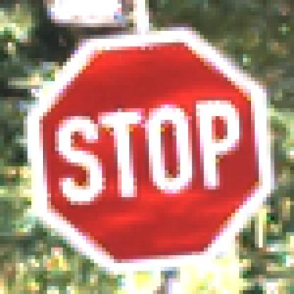
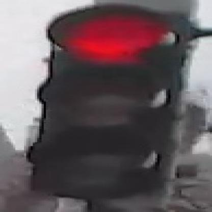
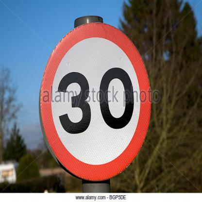

# Traffic Sign Recognition

## Overview 
This project utilizes the "Self-Driving Cars - v6 Version 4" dataset to develop a computer vision model for identifying road signs. The dataset consists of 4969 images, with signs annotated in the YOLOv8 format. Each image has been pre-processed by resizing it to a fixed resolution of 416x416 pixels. This project's goal is to train a robust model that can accurately detect and classify various road signs, which is a crucial component for autonomous vehicle navigation systems.

### Problem Statement
Traffic signs are critical for ensuring road safety as they convey essential information to drivers. An automated recognition system can help improve safety and efficiency on the roads. For example, a system should recognize a "Stop" sign and alert the driver to stop the vehicle, thereby preventing accidents.

### Example Images
- **Stop Sign**:  
  

- **Signal Sign**:  
  

- **Speed Limit**:  
  

## Datasets
- Dataset Name: Self-Driving Cars - v6 Version 4 - Prescan - 416x416
- Source: Roboflow
- Number of Images: 4969
- Annotation Format: YOLOv8
- Annotation Classes: Signs

### Dataset Structure
```
data/ 
    ├── Train/ # Contains train images organized by class
    ├── Test/ # Contains test images organized by class
    
```
### CSV Files
- **`Train.csv`**: Contains paths and labels for the training set.
- **`Test.csv`**: Contains paths and labels for the test set.

## Project Structure

```
    traffic-sign-recognition/
    │
    ├── data/
    │   ├── Meta/
    │   ├── Test/
    │   ├── Train/
    │   └── ...
    ├── scripts/
    │   ├── data_preprocessing.py
    │   ├── eda.py
    │   ├── model_training.py
    │   ├── evaluation.py
    │   ├── inference.py
    │   └── streamlit_app.py
    ├── main.py
    ├── requirements.txt
    └── README.md
```

## Setup and Installation
1. **Clone the Repository**:
   ```bash
       git clone <repository-url>
       cd traffic-sign-recognition
        python3 -m venv env
        source env/bin/activate  # On Windows use `env\Scripts\activate`
        pip install -r requirements.txt

# Usage

### Data Preprocessing

To preprocess the dataset:
```
    python main.py --data --data_dir data
```

### Exploratory Data Analysis (EDA)
To generate visualizations and understand the dataset:
```
python main.py --eda --data_dir data --output_dir outputs

```

### Model Training
To train the YOLOv8 model on the preprocessed data:

```
python main.py --training --data_dir data --model_dir models --epochs 20 --batch_size 64 --learning_rate 0.001
```

### Model Evaluation
To evaluate the trained model:
```
python main.py --evaluation --data_dir data --model_dir models --output_dir outputs
```

### Inference
To make predictions on new images:

```
python main.py --inference --model_dir models --image_path path/to/image.jpg

```

### Django Application
To launch the Django application for interactive traffic sign recognition:

```
python manage.py runserver
```


### Notes
- **Image Paths**: Ensure to replace `data/Train/00000.png`, etc., with actual paths to your images.
- **Repository URL**: Replace `<repository-url>` with the actual URL of your GitHub repository.

This `README.md` provides a comprehensive overview of your project, making it easy for users to understand its purpose and how to use it effectively. Let me know if you need further adjustments or additions!


